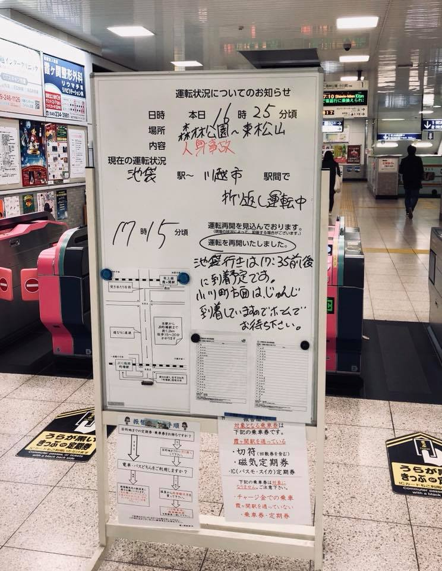

# JapanRailwayAccident
# 前言
  
@Photo credit to Prof.Jauer
>東京的電車經常傳出「人身事故」的消息。在日本是怎麼對待人身事故呢？車站內的電子告示板，打出短短幾行字：「XX線往○○方向因為人身事故的關係，現在停駛」，除此之外，再沒任何訊息。是誰？甚麼原因？自殺還是意外？死還是活？電視新聞不會報導，網上新聞也找不到。由於電聯車引起的「人身事故」的頻率太多，讓人不禁懷疑：是否連輕傷或車門夾到皮包，在日本都以「人身事故」視之，所謂「人身事故」其實只是虛驚一場？
我抱著疑惑，問了日本同事。同事的回答如下：
「虛驚一場？人和電聯車撞，還可能是虛驚一場？當然是非死即殘！」
「事故原因是？」我追問道。
「當然是自殺。」同事雲淡風輕地說著：「我還可以告訴你，東京的『中央線』死人最多，知道為甚麼嗎？」
「為甚麼？」
「因為路線直，車速快，死得快。」

>同事替我解了部分疑惑。我想起每次在車站目擊「人身事故」四個大字時，感受不到車站人群表情上一絲絲躁動。大家如平時般上車、下車、等車。沒看到人們針對事件竊竊私語。「人身事故」四個原本分量很重的字，頂上的電子看板一打出，就如一陣風似地從人的頭上吹過，驚不起一點點波瀾。 - 老侯

# 問題
日本鐵道的人身事故發生頻繁，有人說最常發生在晚上應酬完畢，喝得醉醺醺導致不小心跌落軌道的上班族身上，也有人說最常發生在速度快的中央線上，但以上敘述都是正確的嗎? 透過這個side project，希望可以分析日本鐵道人身事故發生的地點和時間等探索性分析。

# 方法
1. Web crawling from 鉄道人身事故データベース https://accident.laboneko.jp/
2. Pandas for data preproces, transfer gender into binary data and split the timestamp.

